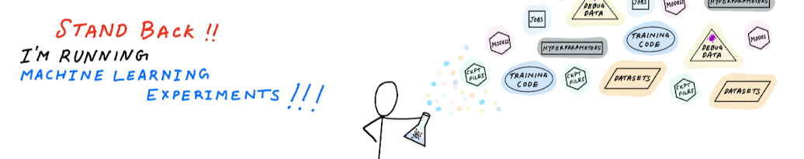

<!--  -->

 

# Shashank Prasanna

Hi! 👋🏽  I'm a multi-disciplinary engineer and technology educator. I'm passionate about statistics, machine learning, numerical optimization, non-linear dynamical systems, high-performance computing and specialized machine learning processors.

I have an MS in Electrical Engineering from Arizona State University, where I specialized in Control Theory and Non-linear Dynamics.

Currently I work as a Developer Advocate at AWS, where I focus on educating developers and data scientists on topic of machine learning algorithms, open-source frameworks, distributed machine learning and machine learning hardware (GPUs, AI accelerators). `If you'd like me to speak at your event, please send me a note using my social media handles on the right 👉🏽` 

