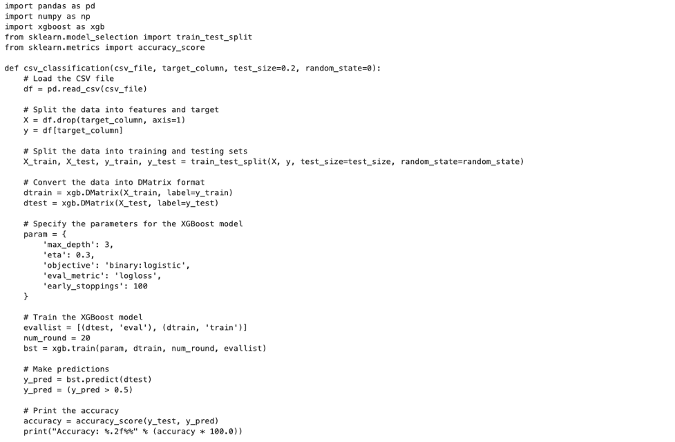
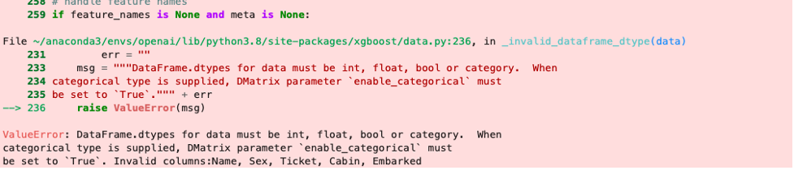
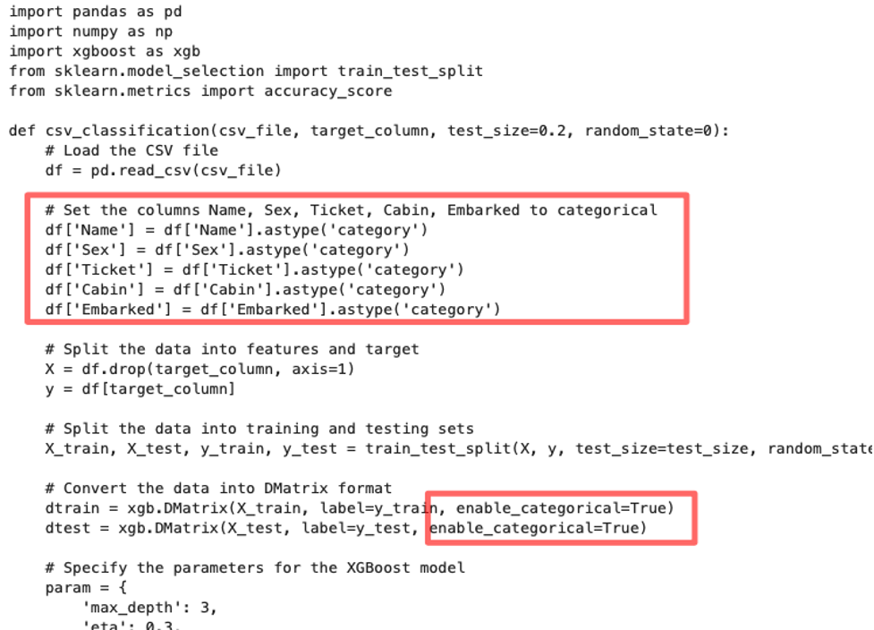
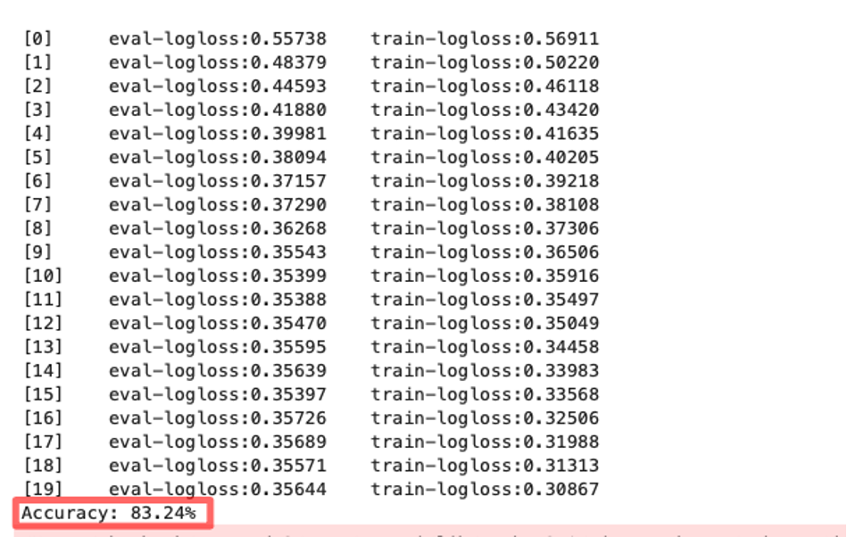
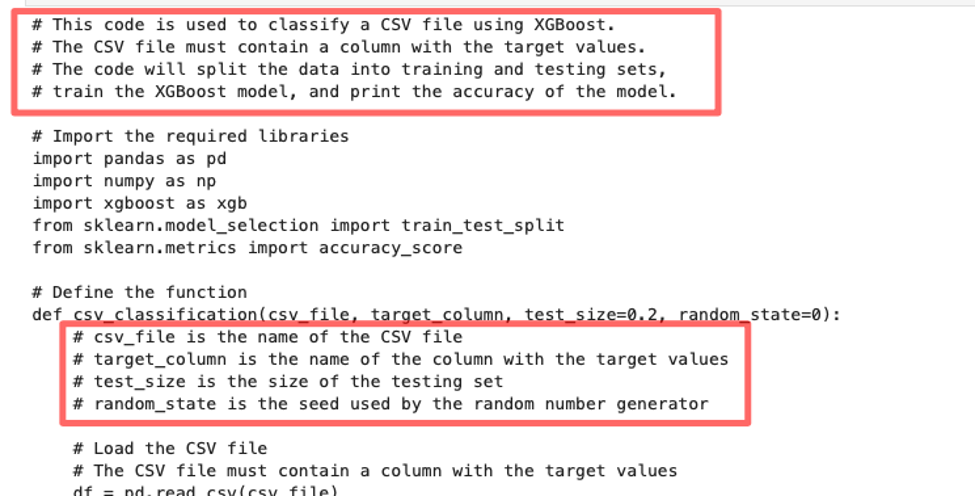
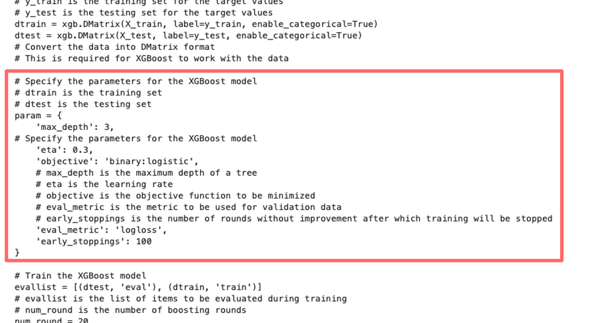
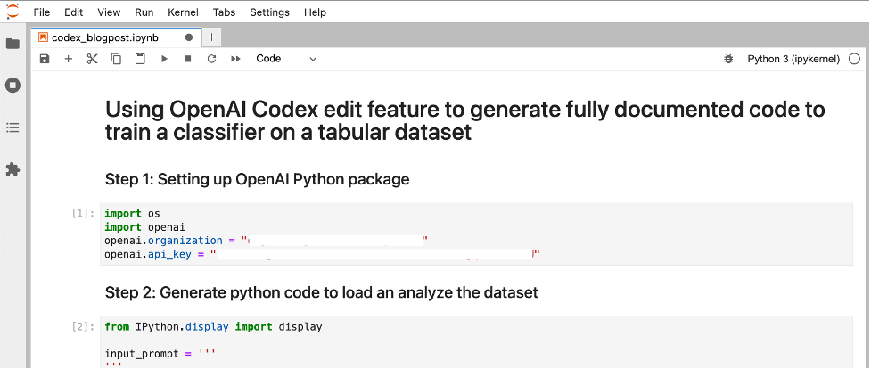

We've all dealt with the frustration of poor or incomplete documentation in software projects. In their [2021 state of the Octoverse survey](https://octoverse.github.com/creating-documentation/), GitHub found that easy to use documentation, boosted developer productivity by 50% and improved contribution quality, yet it continues to be an under-invested area across open-source projects.

Using OpenAI Codex you can use to automatically edit existing code to add documentation using only natural language instructions. This new feature will let you spend more time developing new features and reviewing generated documentation instead of writing documentation from scratch. In addition to generating documentation, Codex's edit feature can refactor code, update logic, translate between programming languages and change coding styles.

In this blog post, we'll take a look at how Codex edit feature works through a code example. One of my favorite areas of machine learning (ML) research is automated machine learning (AutoML) or low-code ML. I'll use Codex to implement a simple data science workflow only using natural language instructions and without writing any ML code. We'll perform the following steps only using Codex's Edit API and discuss its features as we implement the code example:

1.  Generate python code to load a dataset and visualize it

2.  Generate python code to train a machine learning classifier on the dataset

3.  Edit generated code to customize it for the specific problem dataset

4.  Edit updated code to add detailed documentation

Sounds exciting? Let's get started!

## Using OpenAI Codex edit feature to generate fully documented code to train a classifier on a tabular dataset

Let's use OpenAI Codex to solve the [Titanic - Machine Learning from Disaster](https://www.kaggle.com/c/titanic/data) Kaggle competition. The titanic dataset consists of passenger information like name, age, gender, etc. and if they survived the disaster or not. We'll use natural language prompts to iteratively build code and documentation. To download the dataset, you'll need to create a free Kaggle account and download it either via the web page or by following the instructions on the [Kaggle API GitHub page](https://github.com/Kaggle/kaggle-api).

Next, you'll need an Open AI account. If you're new to OpenAI, head over to [https://openai.com/api/login/](https://openai.com/api/login/) and create your free trial account. This will give you access to \$18 in free credit that you can use for upto 3 months.

After you've created your account, you'll have access to your unique API keys that you can use to invoke the OpenAI API using the official [Python](https://beta.openai.com/docs/libraries/python-bindings), Node.js or any of the [community supported libraries](https://beta.openai.com/docs/libraries/community-libraries). Since our example generates Python code, we'll use the Python bindings.

### Step 1: Setting up OpenAI Python package

Open your favorite IDE to get started, I prefer Jupyter Lab as it's the most popular IDE used by data scientists. Import openai Python package and specify your organization and API keys. You can find these on your Open AI account.

```python
import os
import openai
openai.organization = "org-XXXXXXXXXXXXXXX"
openai.api_key = "sk-XXXXXXXXXXXXXXXX"
```

### Step 2: Generate python code to load an analyze the dataset

We can use the Codex edit feature to edit existing code or generate new code. Let's start by generating some fresh code to load our Titanic CSV dataset and analyze it.

Here's what the arguments to the create() function mean:

-   **Input**: Provide a prompt as a starting point. We leave it empty since we're going to generate new code and not edit existing code.

-   **Instructions**: Provide instructions to Codex on what code to generate. Here we describe that we want to generate code to load and analyze our CSV dataset.

-   **Engine**: Provide the engine for Codex edit feature, the latest name and version is `Code-davinci-edit-001`

-   **Temperature** and **top_p**: used to control how deterministic the model is in generating a response. I choose a lower value for top_p (=0.2) to get a consistent response.

You can find more information about the API in the [Edits documentation](https://beta.openai.com/docs/api-reference/edits/create).

```python
from IPython.display import display

input_prompt = '''
'''
instruction = '''
Write python function to load a CSV file called titanic.csv into a dataframe and use display function'''

response = openai.Edit.create(input=input_prompt, 
                              instruction=instruction, 
                              engine="code-davinci-edit-001",
                              temperature=1,
                              top_p=0.2)

```

**Output:**

When you run the code, you should see an output that looks like the screenshot below. From the output we can see that the dataset has both numeric and categorical variables. This information will come in handy later when we ask Codex to edit our function. For now, let's continue to build on this program to classify the dataset.


### Step 3: Generate a Python program to classify the dataset

In this step, rather than leave the input prompt empty, let's provide the function signature we expect so Codex can fill out the rest of the program. Under instructions we provide:

-   "Write python function to load a CSV file and perform binary XGBoost classification on a target column:

Extending our previous example, we'll ask Codex to generate a program to use XGBoost to classify our dataset based on a specified target variable. If you're new to machine learning, XGBoost is a fantastic works-out-of-the-box classifier for tabular datasets that often requires little to no fine tuning to get acceptable results.

```python
input_prompt = '''
def csv_classification(csv_file, target_column):
'''

instruction = '''
Write python function to load a CSV file and perform binary XGBoost classification on a target column'''

response = openai.Edit.create(input=input_prompt, 
                              instruction=instruction, 
                              engine="code-davinci-edit-001",
                              temperature=1,
                              top_p=0.2)

generated_code = response["choices"][0]["text"]
print(generated_code)

```

**Output:**

Codex generates the following code to classify our dataset using XGBoost. If you're new to machine learning, let's just take a moment to appreciate how much time we saved by having Codex generate this vs. writing this from scratch. We still need to test if this code works, so let's go ahead and do that in the next step.



```python
exec(generated_code)
csv_classification('titanic.csv','Survived')
```

**Output:**

Oh no! the generated code throws an error! Not what we want to see, but let's take a closer look at the error message. The error message says:

1.  We have categorical variables that need to be specified as categorical variables. If we go back to the output of Step 1, we can verify from that the Name, Sex, Ticket, Cabin and Embarked are indeed categorical.

2.  Since we have categorical variables, we need to instruct XGBoost to enable categorical support using \`enable_categorical\` argument.

To remedy this, let's make Codex do all the hard work by simply copying the error message and including it in the instructions of the next step.



### Step 4: Fixing errors in the generated code by updating the instructions

In this step, we start with the generated code from Step 3, and provide instructions to make changes specified in the error message. We provide the following instructions:

-   "Update code to set dataframe columns Name, Sex, Ticket, Cabin, Embarked to categorical and set DMatrix parameter \'enable_categorical\' to \'True\'"

```python
input_prompt = generated_code

instruction = '''
Update code to set dataframe columns Name, Sex, Ticket, Cabin, Embarked to categorical and set DMatrix parameter 'enable_categorical' to 'True'
'''

response = openai.Edit.create(input=input_prompt, 
                              instruction=instruction, 
                              engine="code-davinci-edit-001",
                              temperature=1,
                              top_p=0.2)

generated_code = response["choices"][0]["text"]
print(generated_code)

```

**Output:**

This generates updated code that addresses the categorical variable errors by converting the specified column into categorical and by setting enable_categorical to True when creating the XGBoost's native DMatrix data structure. Again let's take a moment to appreciate how little we had to do to generate code for a generic tabular data classifier using XGBoost.



Let's go ahead and execute this code to train our classifier:

```python
exec(generated_code)
csv_classification('titanic.csv','Survived')
```

**Output:**

Sure enough, our code now runs without any issues and trains the classifier to 83% accuracy on the test set. Note that this is a very simple dataset, but the generated code can now be used for a number of tabular classification problems. Need to modify the code to change features? Just repeat the instructions in this step to specify what needs to be updated.



### Step 5: Generate detailed documentation

Finally, let's use the generated code and add detailed documentation to it using Codex. To do that we provide natural language instructions on how and where to add comments:

-   "Add a detailed paragraph at the top of the code describing what the code is doing, and add detailed comments explaining every line of code"

```python
instruction = '''
Add a detailed paragraph at the top of the code describing what the code is doing, and add detailed comments explaining every line of code
'''

response = openai.Edit.create(input=generated_code, 
                              instruction=instruction, 
                              engine="code-davinci-edit-001",
                              temperature=1,
                              top_p=0.2)

documented_code = response["choices"][0]["text"]
print(documented_code)

```

**Output:**

Here you can see the detailed description of the full program, you can also see that the additional comments were automatically added under the function definition describing each line of code.



If you're new to XGBoost, you can also use the generated documentation to learn about what each of the hyperparameters mean! Now you know that eta is actually the learning rate, and max_depth is the maximum depth of each of the 20 trees XGBoost uses. How cool is that?



We now have a fully functional and documented code that you can use to submit your results to the Titanic Kaggle competition!

## Now it's your turn!

If this piqued your interest head on over to [https://openai.com/api/login/](https://openai.com/api/login/) and create your free trial account. I'm making all the code used in this blog post is available as a Jupyter notebook on GitHub so you can run the entire example with a single click

Now it's your turn! How will you use Codex's new edit feature? Let me know by reaching out to me at [@shshnkp](https://twitter.com/shshnkp)

